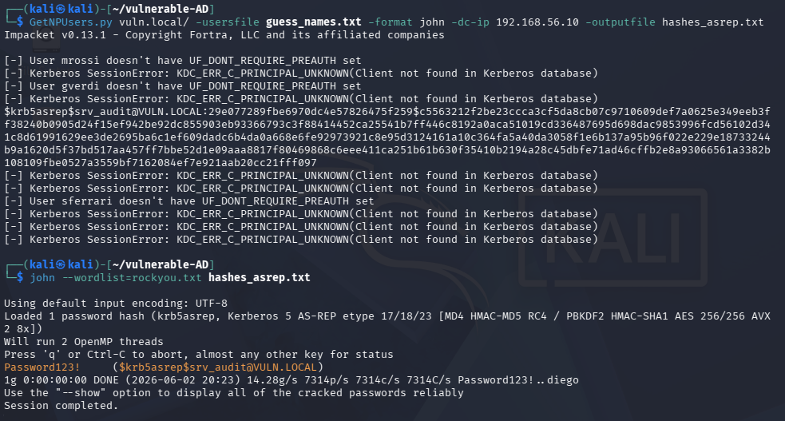
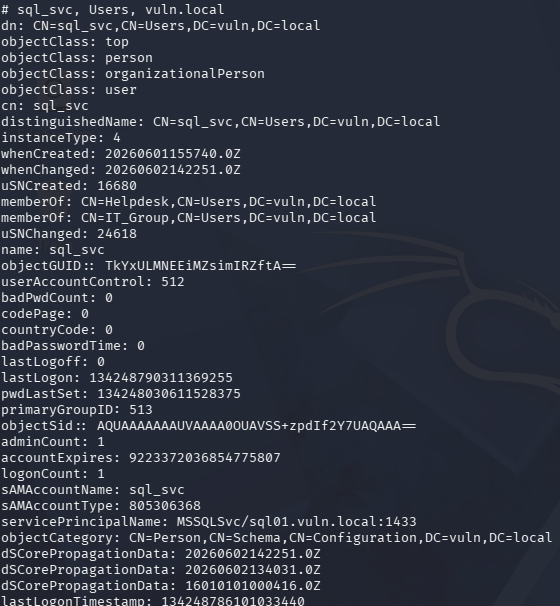
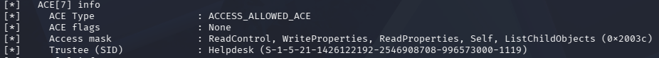
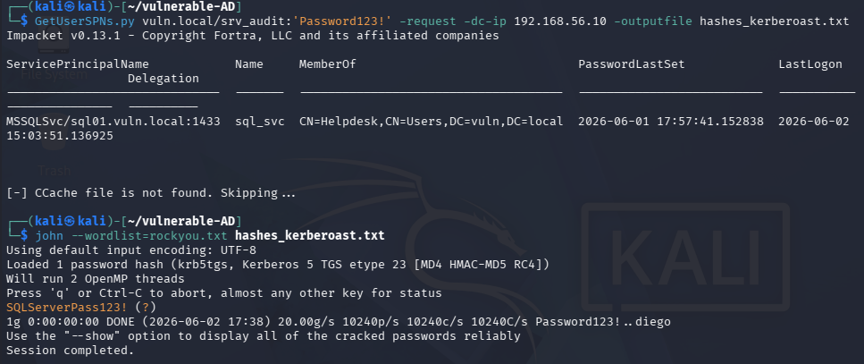
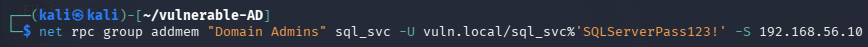
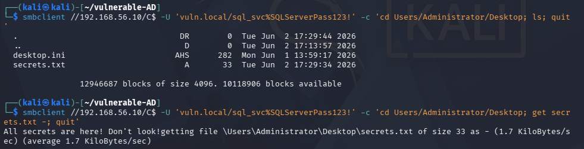

# Active Directory Domain Compromise via AS-REP roasting and Kerberoasting

## Introduction to the Attack
The idea of this demo was to create and attack a small organization that uses Windows Active Directory which has several misconfigurations.

### Goal
The `Administrator` has the file `secrets.txt` on his desktop, the demo is designed for obtaining it as the final goal.

### Virtual Machines
Two virtual machines were used for the demo:
+ A VM in which is installed Windows Server 2022 that will act as the Domain Controller for the domain "vuln.local", created expressly for the demo
+ A Kali Linux VM, that will be used by the Attacker

### Domain Overview
The Domain Controller (DC) is configured with the static IP address 192.168.56.10.
In order to simulate a small corporate infrastructure, the domain environment was populated with:
+ 12 user accounts: `srv_audit` + 11 `Name Surname` accounts (sAMAccountName: `nsurname`)
+ 1 service account `sql_svc` mapped to a Service Principal Name (SPN)
+ 4 groups: `RisorseUmane`, `Finanza`, `IT_Group` and `Helpdesk`.

In order to create an environment ready to be attacked, and that simulates an organization with exploitable misconfigurations:
+ The account `srv_audit` has been configured with the "Do not require Kerberos preauthentication" attribute
+ The service `sql_svc` was added to the Helpdesk group.
+ The Helpdesk group is overprivileged has Write permissions to the `Domain Admins` group.

### Threat Model
The Threat Model for the demo is that the attacker:
+ Can communicate with the DC
+ Knows the naming convention of the organization

In order to execute the attack, 2 text files were created:
  - `guess_names.txt`: targeted list of potential domain usernames.
  - `rockyou.txt`: dictionary containing possible passwords for cracking.

## Tools Utilized
+ Impacket
  - GetNPUsers.py
  - GetUserSPNs.py

+ Openwall (John the Ripper)
  - john

+ OpenLDAP
  - ldapsearch

+ bloodyAD (CravateRouge)
  - dacledit.py

+ Samba
  - net rpc
  - smbclient

+ RockYou Leak (Kali Linux Wordlists)
  - rockyou.txt

## Attack Execution
### AS-REP roasting
Using LDAP queries, `GetNPUsers.py` contacts the DC to verify whether the usernames provided within the `guess_names.txt` file match actual accounts in the target domain. Specifically, the script checks if any of these users do not require Kerberos pre-authentication. Once a matching account with this misconfiguration is identified, the script constructs and transmits an unauthenticated AS-REQ message to the DC. In response, the DC issues an AS-REP message containing the TGT (Ticket Granting Ticket) along with an encrypted segment ciphered with the user's password key. The resulting TGT hashes are saved in another text file which will be created at the moment.
In the command there is specified the format "john"; in fact once the TGT is obtained, John the Ripper (john) is used to perform password cracking.
As wordlist, `rockyou.txt` is used and the cracking is performed on the TGT in the text file previously created.
As a result the password of `srv_audit` is obtained and the AS-REP roasting is successful.

*Figure 1 — AS-REP roasting execution*

### Domain discovery
The next step is to have more information about the domain, using the credentials obtained with the previous step 2 actions were performed:
1. Discover which services are present in the domain
2. Discover the access rights on the "Domain Admins" group

#### Service discovery
Using the `ldapsearch` utility, a targeted query against the DC using the previously compromised credentials of  `srv_audit` is performed. By applying the selective filter `'(servicePrincipalName=*)'`, were shown all and only the service accounts linked to a Service Principal Name (SPN).

In the demo are present only 3 services: Active Directory Domain Services (AD DS), Kerberos Key Distribution Center (KDC), and `sql_svc`.
It has been done using the command:

`ldapsearch -x -H 'ldap://192.168.56.10' -D 'srv_audit@vuln.local' -w 'Password123!' -b 'DC=vuln,DC=local' '(servicePrincipalName=*)'`.

As a result it can be observed that `sql_svc` is in the `Helpdesk` group, indicating a misconfiguration.

*Figure 2 — Detail of the information about `sql_svc`*

#### Gathering information about the `Domain Admins` group
To obtain information about the `Domain Admins` group, the utility `dacledit.py` has been used. This tool is specifically designed to query and modify Access Control Lists (ACLs) within Active Directory, and in this case, the action performed is to read the permissions of the target group.
The command is:
`dacledit.py -action read -target 'Domain Admins' -dc-ip 192.168.56.10 vuln.local/srv_audit:'Password123!'`.

By reading the information, specifically at ACE[7] (Access Control Entry), which is the individual rule within the ACL that defines the permissions granted to a specific trustee, it can be seen that the group `Helpdesk` is present. This configuration grants the Helpdesk group full Write permissions over the `Domain Admins` group, exposing a critical security misconfiguration.

*Figure 3 — Detail of the ACE[7]*

#### Discovery results
By exposing these two misconfigurations, it becomes clear that `sql_svc` is crucial for the continuation of the attack.

### Kerberoasting
For performing Kerberoasting, the `GetUserSPNs.py` utility is used, it does a initial scan to see which accounts have an SPN and then, using the `-request` parameter in the command, it requests the Kerberos TGS for the services it found; to find them he script searches in the Active Directory via LDAP to locate accounts linked to a SPN.
As for AS-REP roasting: the resulting TGS hashes are saved in a text file which will be created at the moment, the john format is specified.
After the TGS is obtained, john is used again to perform password cracking.

*Figure 4 — Kerberoasting execution*

### Domain Admins Abuse
Since the Kerberoasting was successful, now is possible to take advantage of the privileges that `sql_svc` has, being in the `Helpdesk` group.

*Figure 5 — Privilege escalation*

The command utilizes the `net` utility via the Remote Procedure Call (RPC) protocol. RPC is a standard network communication protocol used by Windows environments that allows a client, in this case the Kali Linux machine, to request the execution of a specific administrative action directly on a remote server, the DC.

By establishing an RPC connection authenticated with the cracked credentials of `sql_svc`, the command invokes the remote procedure required to modify group memberships on the DC. Since `sql_svc` inherits the necessary write permissions from the `Helpdesk` group, the DC accepts the request and inserts `sql_svc` in the `Domain Admins` group.

### Data Exfiltration

After performing the privilege escalation, there is the possibility to look what the `Administrator` has on his desktop and subsequently acquiring it, specifically the file `secrets.txt`.
To achieve this, the Server Message Block (SMB) protocol is utilized to interact directly with the administrative network shares of the DC.

First, an enumeration of the `Administrator` desktop directory is performed.
The connection exploits the administrative share `C$`. Access to this specific share is strictly restricted by Windows to members of the local `Administrators` or `Domain Admins` groups. Since the `sql_svc` account was successfully added to the `Domain Admins` group in the previous step, the DC grants full read and write access to the entire file system.
The output of the directory listing confirms the presence of the targeted file, `secrets.txt`.
Then, by using the `get` command followed by a `-`, the content of `secrets.txt` is retrieved via the SMB channel and printed directly into the standard output of the terminal.
The message "All secrets are here! Don't look!" is the actual content of the file `secrets.txt`.

*Figure 6 — Data exfiltration*

## Conclusions
As said in the introduction, the demo proposed tries to simulate an attack to a small organization which use Windows Active Directory, since the AD has been configured expressly for the realization of the demo without the use of pre-configured AD, the misconfigurations are product of the imagination.

The environment was created to show different steps of an attack starting with little information about the domain: using a list of possible names for the AS-REP roasting, discovering the services present and the access rights on the `Domain Admins` group, and searching in the `Administrator` desktop to find the `secrets.txt` file.

The idea and structure of both the attack and the Active Directory is authentic; for the realisation, the usage of Gemini AI has been crucial for the Windows Server setup and creation of the misconfigured AD.

## Bibliography
* **[1] Windows Server 2022**
  * URL: [https://www.microsoft.com/it-it/evalcenter/download-windows-server-2022](https://www.microsoft.com/it-it/evalcenter/download-windows-server-2022)

* **[2] Gemini**
  * URL: [https://gemini.google.com/app?hl=it](https://gemini.google.com/app?hl=it)

* **[3] Impacket**
  * URL: [https://github.com/fortra/impacket](https://github.com/fortra/impacket)

* **[4] John the Ripper**
  * URL: [https://github.com/openwall/john](https://github.com/openwall/john)

* **[5] AS-REP roasting**
* URL: [https://www.youtube.com/watch?v=wA9w8t1fRWo](https://www.youtube.com/watch?v=wA9w8t1fRWo)

* **[6] Kerberoasting**
* URL: [https://www.youtube.com/watch?v=tRCvagjqx3c](https://www.youtube.com/watch?v=tRCvagjqx3c)

* **[7] RockYou Leak**
* URL: [https://www.kali.org/tools/wordlists/](https://www.kali.org/tools/wordlists/)

* **[8] Discovery**
* URL: [https://github.com/ShubhamDubeyy/Active-Directory-Workbook#module-4-enumerating-users-groups--privileged-accounts](https://github.com/ShubhamDubeyy/Active-Directory-Workbook#module-4-enumerating-users-groups--privileged-accounts)
* URL: [https://github.com/fortra/impacket/blob/master/examples/dacledit.py](https://github.com/fortra/impacket/blob/master/examples/dacledit.py)

* **[9] Privilege escalation**
* URL: [https://www.thehacker.recipes/ad/movement/dacl/addmember](https://www.thehacker.recipes/ad/movement/dacl/addmember)

* **[10] Data exfiltration**
* URL: [https://hackviser.com/tactics/tools/smbclient](https://hackviser.com/tactics/tools/smbclient)
* URL: [https://www.samba.org/samba/docs/current/man-html/smbclient.1.html](https://www.samba.org/samba/docs/current/man-html/smbclient.1.html)

